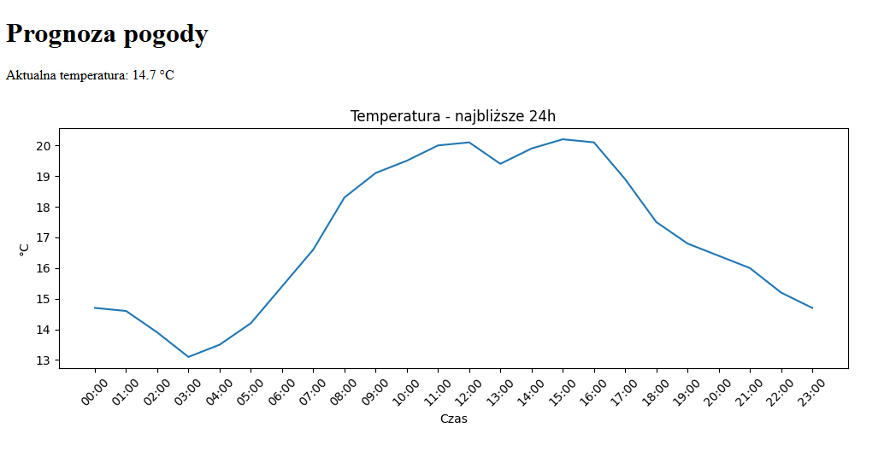
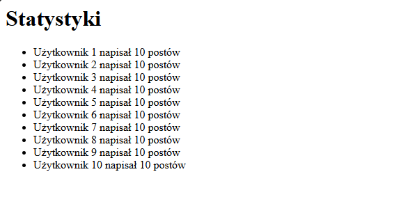
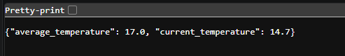

# Sprawozdanie z Laboratorium nr 2  

**Przedmiot:** Integracja Systemów Informatycznych  
**Temat:** Integracja z zewnętrznymi API i przetwarzanie danych
**Data:** 2026-05-30
**Student:** Aleksandr Vasiljev

---

## 1. Cel laboratorium

Rozbudowa aplikacji o mechanizmy integracji z zewnętrznymi źródłami danych. W ramach laboratorium należy zintegrować aplikację z co najmniej dwoma wybranymi zewnętrznymi API. W instrukcji skupiamy się na Open-Meteo oraz JSONPlaceholder, jednak są to tylko propozycje – możesz wybrać dowolne inne darmowe API (pełna lista dostępna pod adresem: https://github.com/public-apis/public-apis). Nauka pobierania, filtrowania i transformacji danych JSON, a także ich wizualizacji (np. wykresy) i wyświetlania w aplikacji webowej.

---

## 2. Realizacja zadań

W trakcie laboratorium utworzono aplikację external_data w Django oraz rozwijano ją zgodnie z podejściem pracy na gałęziach (feature branch). Wszystkie zmiany były wykonywane w osobnej gałęzi `feature/external-api-integration`.

---

### Zadanie 1: Praca na gałęziach

- **Opis działań:**
 Stworzono nową gałąź: `external-api-integration`.
- **Zastosowane komendy Git:**
  
```bash
git checkout -b feature/external-api-integration

```

### Zadanie 2: Przygotowanie struktury

- **Opis działań:**
  Stworzono nową aplikację (Django: python manage.py startapp external_data).
Zainstalowano biblioteki: requests, matplotlib.

### Zadanie 3: Integracja z Open-Meteo API

- **Opis działań:**
  Napisano logikę pobierającą prognozę pogody dla miasta Gdańsk. Wyciągnieto z odpowiedzi API listę temperatur (temperature_2m) oraz odpowiadające im czasy (time) dla najbliższych 24 godzin. Wygenerowano wykres temperatury za pomocą matplotlib zapisując do pliku media. Wyświetlono aktualną temperaturę oraz wykres na podstronie.

```python
def get_weather(latitude, longitude):
    url = (
        "https://api.open-meteo.com/v1/forecast"
        f"?latitude={latitude}"
        f"&longitude={longitude}"
        "&hourly=temperature_2m"
        "&forecast_days=1"
    )

    try:
        response = requests.get(url, timeout=5)
        if response.status_code != 200:
            return {
                "error": "API error",
                "status_code": response.status_code
            }

        data = response.json()

        times = [
            t.split("T")[1]
            for t in data["hourly"]["time"][:24]
        ]

        temperatures = data["hourly"]["temperature_2m"][:24]

        return {
            "times": times,
            "temperatures": temperatures,
            "current_temperature": temperatures[0]
        }

    except requests.exceptions.Timeout:
        return {
            "error": "Request timeout"
        }

    except requests.exceptions.ConnectionError:
        return {
            "error": "Connection error"
        }

    except requests.exceptions.RequestException as e:
        return {
            "error": "Request failed",
            "details": str(e)
        }
def generate_chart(times, temperatures, filename):
    plt.figure(figsize=(10, 4))

    plt.plot(times, temperatures)

    plt.title("Temperatura - najbliższe 24h")
    plt.xlabel("Czas")
    plt.ylabel("°C")

    plt.xticks(rotation=45)

    plt.tight_layout()

    plt.savefig(filename)

    plt.close()
```

- **Zastosowane komendy Git:**
  
```bash
git add .
git commit -m "Integration with Open-Meteo API and add weather page"   
```

## Zrzut ekranu – Strona weather



### Zadanie 4: Integracja z JSONPlaceholder API

- **Opis działań:**
Pobierano listę postów użytkowników. Przefiltrowano dane tylko posty konkretnego użytkownika.
Policzono liczbę postów na użytkownika. Wizualizacja: Stwórzono listę elementów, gdzie każdy element zawiera wybrane, przetworzone dane "Użytkownik X napisał Y postów".

```python
import requests
from collections import Counter
def get_posts():
    response = requests.get(
        "https://jsonplaceholder.typicode.com/posts"
    )
    return response.json()
def get_user_posts(user_id):

    posts = get_posts()

    return [
        post
        for post in posts
        if post["userId"] == user_id
    ]
def posts_per_user():
    posts = get_posts()
    counter = Counter()
    for post in posts:
        counter[post["userId"]] += 1

    return counter
```

- **Zastosowane komendy Git:**
  
```bash
git add .
git commit -m "Integration with JSONPlaceholder API and add POSTS page"
```

## Zrzut ekranu – Lista postów


  
### Zadanie 5: Własny endpoint API

- **Opis działań:**
  Stworzenie endpointu w swojej aplikacji /api/weather-summary/, który zwraca przetworzone dane z zewnętrznego API w formacie JSON.
Endpoint agreguje dane (średnia temperatura na dzisiejszy dzień).

```python
def get_weather_summary(latitude, longitude):

    data = get_weather(latitude, longitude)

    times = data["times"][:24]
    temps = data["temperatures"][:24]

    return {
        "times": times,
        "temperatures": temps,
        "current_temp": temps[0]
    }
```

- **Zastosowane komendy Git:**
  
```bash
git add .
git commit -m "Add weather summary API endpoint returning JSON data"  
```

## Zrzut ekranu – weather summary



### Wnioski

W trakcie realizacji laboratorium udało się skutecznie zintegrować aplikację Django z zewnętrznymi API, co pozwoliło na praktyczne przećwiczenie pobierania, przetwarzania oraz prezentacji danych w formacie JSON oraz w postaci wizualnej. W szczególności wykorzystano API Open-Meteo do pobierania danych pogodowych oraz JSONPlaceholder do symulacji danych użytkowników i ich aktywności. Zaimplementowane rozwiązania umożliwiły nie tylko pobranie surowych danych, ale również ich przetwarzanie poprzez filtrowanie, agregację oraz wyodrębnianie istotnych informacji, takich jak średnia temperatura czy liczba postów przypadająca na użytkownika. Dodatkowo utworzono własny endpoint API /api/weather-summary/, który udostępnia przetworzone dane w sposób umożliwiający ich dalsze wykorzystanie przez inne systemy.
