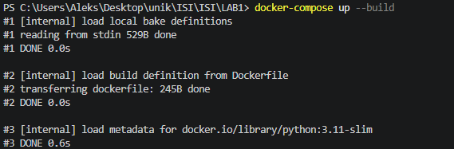
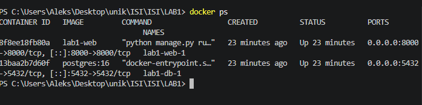
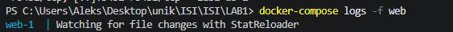
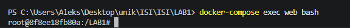
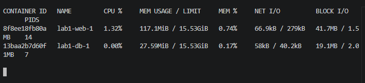

# Sprawozdanie z Laboratorium nr 2  

**Przedmiot:** Integracja Systemów Informatycznych  
**Temat:** Konteneryzacja aplikacji Django za pomocą Dockera
**Data:** 2026-06-01
**Student:** Aleksandr Vasiljev

---

## 1. Cel laboratorium

Przygotowanie aplikacji do pracy w środowisku izolowanym przy użyciu Dockera. Konfiguracja Dockerfile oraz docker-compose dla aplikacji Python (Django).

---

## 2. Realizacja zadań

Wszystkie zmiany były wykonywane w osobnej gałęzi `feature/dockerization`.

---

### Zadanie 1: Przygotowanie środowiska

- **Opis działań:**
 Stworzono nową gałąź: `feature/dockerization`. Dodano plik `.dockerignore`, aby uniknąć kopiowania zbędnych plików.
- **Zastosowane komendy Git:**
  
```bash
git checkout -b feature/dockerization

```

### Zadanie 2: Tworzenie Dockerfile

- **Opis działań:**
 Przygotowano plik Dockerfile oraz zbudowano obraz.

```Dockerfile
FROM python:3.11-slim

WORKDIR /LAB1

COPY requirements.txt .

RUN pip install --no-cache-dir -r requirements.txt

COPY . .

EXPOSE 8000

CMD ["python", "manage.py", "runserver", "0.0.0.0:8000"]
```

- **Zastosowane komendy Git:**
  
```bash
git add .
git commit -m "Add Dockerfile and .dockerignore"

```

### Zadanie 3: Orkiestracja z Docker Compose

- **Opis działań:**
Stwórzono plik docker-compose.yml zawierający serwis web oraz db.
Skonfigurowano zmienne środowiskowe dla połączenia z bazą danych.
Uruchumiono cały stos: `docker-compose up`.

```yml
services:
  web:
    build: .
    ports:
      - "8000:8000"
    depends_on:
      - db
    environment:
      DB_NAME: mydb
      DB_USER: postgres
      DB_PASSWORD: postgres
      DB_HOST: db

  db:
    image: postgres:16
    restart: always
    environment:
      POSTGRES_DB: mydb
      POSTGRES_USER: postgres
      POSTGRES_PASSWORD: postgres
    ports:
      - "5432:5432"
    volumes:
      - postgres_data:/var/lib/postgresql/data

volumes:
  postgres_data:
```

- **Zastosowane komendy Git:**
  
```bash
git add .
git commit -m "Add docker-compose for app and database orchestration"   
```

## Zrzut ekranu – Uruchumiono cały stos



### Zadanie 4: Zarządzanie kontenerami i inspekcja

- **Opis działań:**
Sprawdzono działające kontenery: `docker ps`.
Przejrzano logi aplikacji: `docker-compose logs -f web`.
Przejrzno wnętrza kontenera: `docker-compose exec web bash`.
Sprawdzono zużycie zasobów: `docker stats`.
Po uruchomieniu kontenerów wykonano migracje bazy danych wewnątrz kontenera aplikacji Django. Dzięki temu utworzone zostały wszystkie wymagane tabele w bazie PostgreSQL.

## Zrzut ekranu – Kontenery


  
## Zrzut ekranu – Logi



## Zrzut ekranu – Wnętrze kontenera


  
## Zrzut ekranu – Zużycie zasobów



### Wnioski

Podczas laboratorium poznano proces konteneryzacji aplikacji Django z wykorzystaniem Dockera i Docker Compose. Utworzono obraz aplikacji, skonfigurowano połączenie z bazą danych PostgreSQL oraz uruchomiono cały system w odizolowanym środowisku. Nauczyłem się zarządzać kontenerami, analizować logi aplikacji oraz wykonywać migracje bazy danych wewnątrz kontenera. Docker znacząco upraszcza proces uruchamiania aplikacji na różnych środowiskach i zapewnia powtarzalność konfiguracji projektu.
