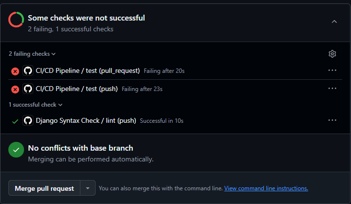
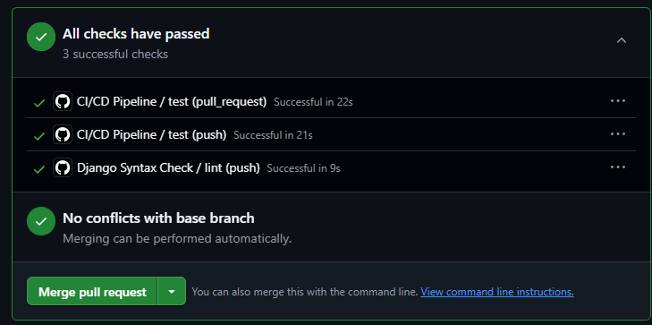
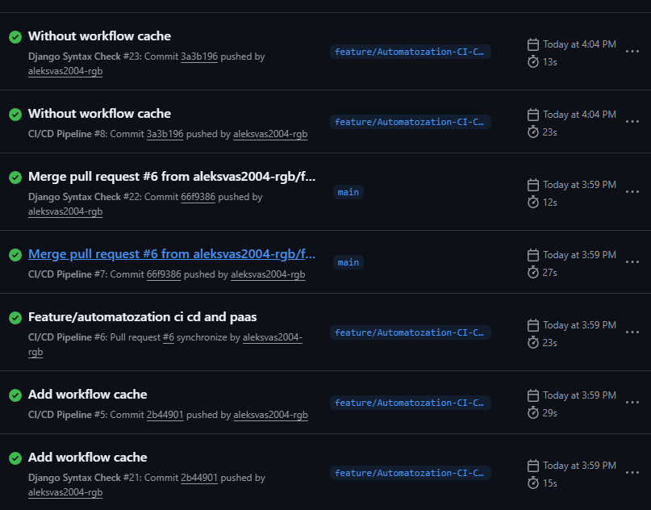
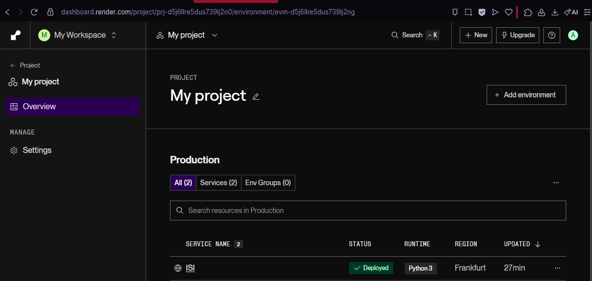
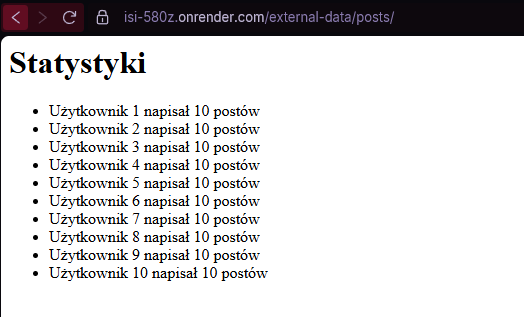
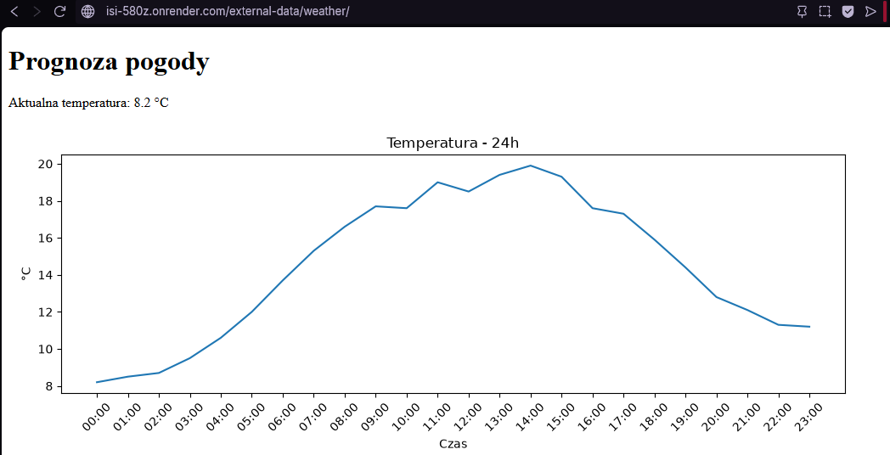

# Sprawozdanie z Laboratorium nr 2  

**Przedmiot:** Integracja Systemów Informatycznych  
**Temat:** Automatyzacja CI/CD z GitHub Actions i wdrożenie PaaS platform typu PaaS.
**Data:** 2026-06-12
**Student:** Aleksandr Vasiljev

---

## 1. Cel laboratorium

Automatyzacja procesów testowania i wdrażania aplikacji przy użyciu GitHub Actions oraz darmowych platform typu PaaS.

---

## 2. Realizacja zadań

W trakcie laboratorium dodano aplikację do RENDER oraz dodano automatyzacje procesów testowania i wdrażania aplikacji. Wszystkie zmiany były wykonywane w osobnej gałęzi `feature/Automatozation-CI-CD-and-PaaS`.

---

### Zadanie 1: Testy jednostkowe

- **Opis działań:**
 Stworzono nową gałąź: `feature/Automatozation-CI-CD-and-PaaS`.
 Napisano oraz uruchomiono testy jednostkowe w blog.

- **Zastosowane komendy Git:**
  
```bash
git checkout -b feature/Automatozation-CI-CD-and-PaaS
git add .
git commit -m "Add unit tests for the application"
```

```python
class BlogTests(TestCase):

    def setUp(self):
        self.user = User.objects.create_user(
            username="testuser",
            password="testpass"
        )

        self.post = Post.objects.create(
            title="Test post",
            content="Test content",
            author=self.user
        )

    def test_post_list_status_code(self):
        response = self.client.get(reverse("post_list"))
        self.assertEqual(response.status_code, 200)

    def test_post_detail_status_code(self):
        response = self.client.get(reverse("post_detail", args=[self.post.id]))
        self.assertEqual(response.status_code, 200)
```

### Zadanie 2: Konfiguracja GitHub Actions CI

- **Opis działań:**
Stwórzono plik .github/workflows/main.yml.
Skonfigurowano potok (pipeline), który po każdym push uruchamia: Lintera oraz testy jednostkowe.
Celowo zepsuto test i sprawdzono, po tym naprawiono błąd.

- **Zastosowane komendy Git:**
  
```bash
git add .
git commit -m "Configure GitHub Actions CI pipeline"
```

## Zrzut ekranu – Złamane testy



## Zrzut ekranu – Naprawione testy



### Zadanie 3: Optymalizacja Workflow - Cache

- **Opis działań:**
  Dodano krok actions/cache do swojego workflow, aby przyspieszyć instalację zależności. Porówna no czas wykonania pipeline'u przed i po dodaniu cache.

- **Zastosowane komendy Git:**
  
```bash
git add .
git commit -m "Add workflow cache"   
```

## Zrzut ekranu – Porównanie cache



### Zadanie 4: Wdrożenie na Render.com

- **Opis działań:**
Połączono swoje repozytorium z Render.
Skonfigurowano "Deploy Hook" (Render).
Dodano krok w GitHub Actions, który po udanych testach wyśle powiadomienie do platformy.

- **Zastosowane komendy Git:**
  
```bash
git add .
git commit -m "Integrate CD with PaaS via Deploy Hook and sanity check"
```

## Zrzut ekranu – Render



## Zrzut ekranu – Lista postów


## Zrzut ekranu – Posts



## Zrzut ekranu – Weather



### Wnioski

W trakcie realizacji laboratorium udało się skutecznie zautomatyzować procesy związane z testowaniem oraz wdrażaniem aplikacji webowej z wykorzystaniem GitHub Actions oraz platformy PaaS Render.com. Integracja CI/CD pozwoliła na pełne uniezależnienie procesu wdrożeniowego od ręcznych działań. Zaimplementowany pipeline CI umożliwia automatyczne uruchamianie testów jednostkowych po każdym pushu do repozytorium, dzięki czemu możliwe jest szybkie wykrywanie błędów już na etapie integracji kodu. Dodatkowo zastosowane cache w workflow nie zmieniło czasu wykonywania pipeline’u. W części dotyczącej wdrożenia CD skonfigurowano połączenie z platformą Render.com za pomocą Deploy Hook, co umożliwia automatyczne uruchamianie procesu wdrożeniowego po pomyślnym zakończeniu testów. Dodanie kroku weryfikacyjnego z użyciem polecenia curl pozwala na sprawdzenie dostępności aplikacji po wdrożeniu, co zwiększa niezawodność całego procesu CI/CD. Przeprowadzone ćwiczenie pokazało również znaczenie poprawnej konfiguracji struktury Django (w tym szablonów oraz obsługi plików statycznych i media) w środowisku produkcyjnym. Różnice między środowiskiem lokalnym a chmurowym (Render) uwidoczniły potrzebę dokładnej analizy konfiguracji przed wdrożeniem.
